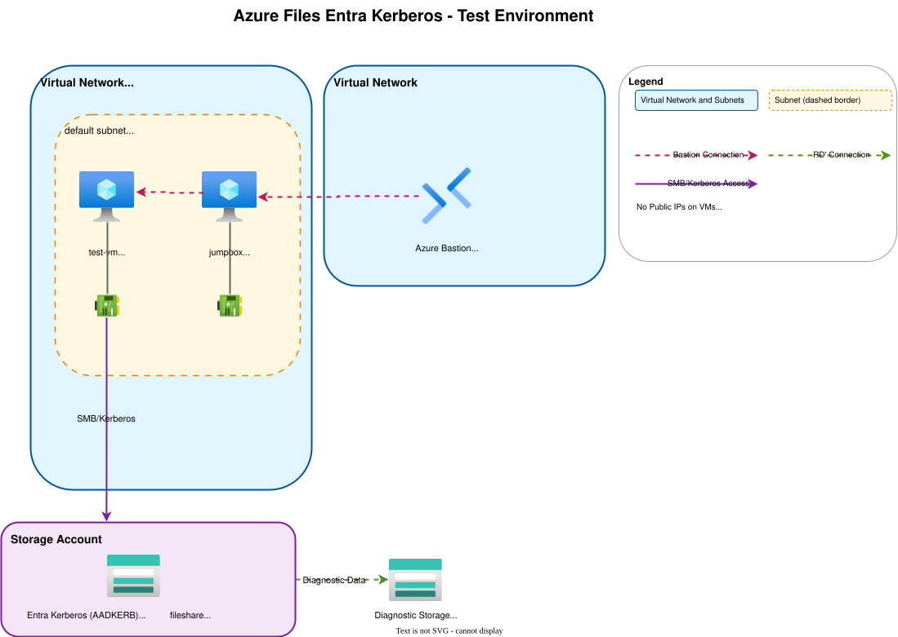

# テンプレートについて
このテンプレートは、Azure Files のクラウド専用 ID の検証環境を作成するためのスクリプトとなります。

具体的には、[Azure Files でハイブリッド ID とクラウド専用 ID (プレビュー) に対して Microsoft Entra Kerberos 認証を有効にする](https://learn.microsoft.com/ja-jp/azure/storage/files/storage-files-identity-auth-hybrid-identities-enable?tabs=azure-portal%2Cregkey#disable-multifactor-authentication-on-the-storage-account) にて紹介されている手順の、**クライアントを構成して Kerberos チケットを取得する** の章までをAzure CLIコマンドを利用して実施するための手順となります。

このテンプレートでは、以下のようなリソースを作成します。

- VM: 2台(踏み台用とクラウド専用ID検証用)
- ストレージアカウント: Azure Filesのデプロイ用途
- VNet: VMをデプロイするための仮想ネットワーク
- Azure Bastion (Developer SKU): VMへの安全なアクセスを提供

構成のアーキテクチャ図は以下の通りです。



## テンプレートファイルの構成
- `vm.bicep`: VM、ネットワーク、Bastionリソースをデプロイ
- `main.bicep`: Storage Accountとファイル共有をデプロイ


# テンプレートの実行
## 前提
この手順では、Azure CLI を利用してデプロイします。
`az login` コマンドでログイン済みの状態で、コマンドを実行してください。

## 実行方法
テンプレートを実行するには、以下のコマンドを実行します。

### 1. VMとネットワークリソースのデプロイ
```bash
az group create --name <Resource Group Name> --location <Location for Resource Group>
az deployment group create --name vm-deployment --resource-group <Resource Group Name> --template-file vm.bicep --parameters adminPassword='<Strong Password>'
```

### 2. Storage Accountのデプロイ
```bash
az deployment group create --name storage-deployment --resource-group <Resource Group Name> --template-file main.bicep --parameters storageAccountName='<Storage Account Name>'
```

### 3. Storage Account でクラウド専用IDを利用した認証を行うための設定
次に、ストレージアカウントのサービスプリンシパルに管理者の同意を与える作業を、以下のコマンドで実施します。

```bash
./update_entraid_grant.sh
```

その後、クラウド専用グループのサポートを有効にするための設定を追加する作業を、以下のコマンドで実施します。

```bash
./update_entra_kerberos.sh
```

その後、Kerberosチケットを取得するために必要な、VM 上のOS設定を更新するために、以下のコマンドを実行します。

```bash
./update_client_setting.sh
```


### 4. VMへのアクセス権限の付与
作成した VM に対して、Entra ID アカウントで接続するためには、作成したリソースグループ、もしくは VM に対して、**Virtual Machine User Login** もしくは、 **Virtual Machine Administrator Login** のロールを接続するEntra IDアカウントに付与する必要があります。

VMへのアクセスは、Azure Bastion（Developer SKU）を使用してAzure Portal経由で行います。


## 補足
このテンプレートでデプロイされる仮想マシンは、Azure Entra Joinが実行されます。
Entra ID では、同一のホスト名のマシンを参加させることができないので、再実行する場合は、VM名を変えるか、Entra IDから デバイスを削除してから、再実行してください。

# 注意事項
- このテンプレートは検証目的のみで使用してください
- デプロイされたリソースは検証後に削除することを推奨します
- パスワードは強力なものを指定してください
- このコードの実行に伴って発生するいかなる不利益に関しても、開発者は一切の責任を負いません